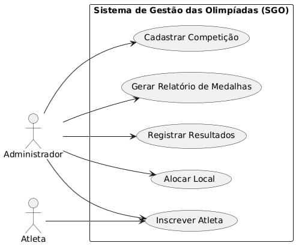
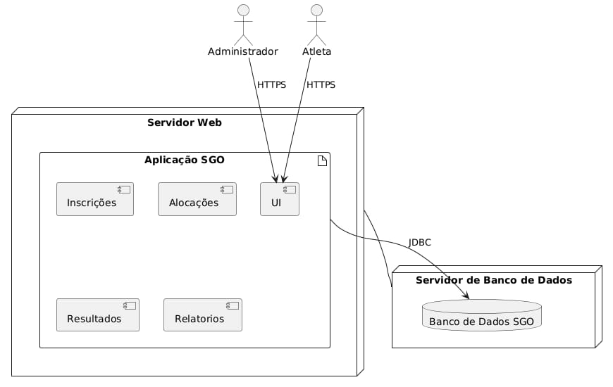
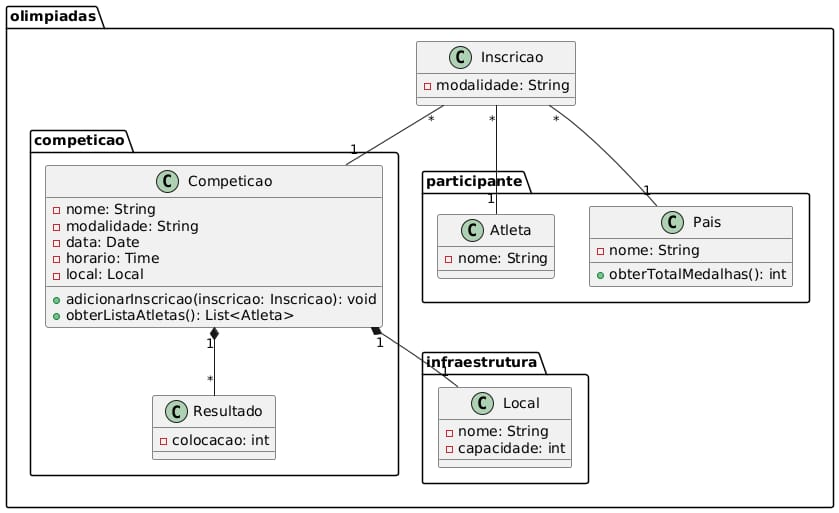
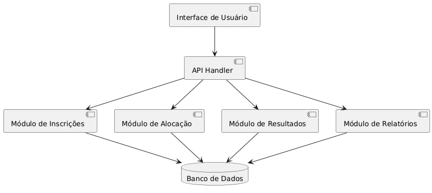

# Sistema de Gestão das Olimpíadas (SGO)
> **Alunos:** Estevão de Faria e Lorrayne Marayze

> **Professor:** João Paulo Aramuni

### Descrição do Sistema
Com a chegada das Olimpíadas, um novo sistema de gestão é necessário para coordenar os diferentes aspectos do evento. Este sistema deve permitir o gerenciamento de competições, inscrições de atletas, alocação de locais para as provas, e controle de resultados.

**Regras de Negócio:**
1. Cadastro de competições:
- O sistema deve permitir o cadastro de competições, que incluem o nome da modalidade, data, horário, local e lista de atletas inscritos.
2. Inscrição de atletas:
- Atletas de diferentes países devem se inscrever em competições específicas. Cada atleta pode participar de várias competições, mas só pode representar um país em cada modalidade.
3. Alocação de locais:
- Os locais para as competições devem ser alocados de forma a evitar conflitos de horário. Um local só pode abrigar uma competição por vez.
4. Controle de resultados:
- Após a realização das competições, os resultados devem ser registrados, determinando o atleta vencedor e os classificados em segundo e terceiro lugares.
5. Relatórios de medalhas:
- O sistema deve gerar relatórios de medalhas, mostrando o desempenho de cada país com base nas medalhas de ouro, prata e bronze conquistadas.

### Histórias de Usuário
UC1: Como administrador do sistema, quero cadastrar novas competições, definindo suas modalidades, datas, horários, locais, níveis de competição e regras de inscrição.

UC2: Como atleta, quero me inscrever em competições específicas, informando meus dados pessoais e escolhendo a modalidade desejada, e receber uma confirmação da minha inscrição.

UC3: Como sistema, quero garantir que cada atleta esteja inscrito em apenas uma modalidade por país, permitindo exceções para competições mistas ou por equipes.

UC4: Como administrador do sistema, quero alocar as competições nos locais adequados, considerando a capacidade de cada local e evitando conflitos de horário.

UC5: Como organizador da competição, quero registrar os resultados de cada prova, indicando os atletas vencedores e classificados, e gerar relatórios com os resultados finais.

UC6: Como administrador ou organizador, quero gerar relatórios detalhados sobre o desempenho de cada país, incluindo o número de medalhas conquistadas em cada modalidade e nível de competição.

UC7: Como espectador ou imprensa, quero acompanhar o cronograma das competições, consultar os resultados das provas e visualizar informações detalhadas sobre os atletas e os locais.

### Diagrama de Caso de Uso

### Diagrama de Componentes

### Diagrama de Classes e de Pacotes

### Diagrama de Implantação

